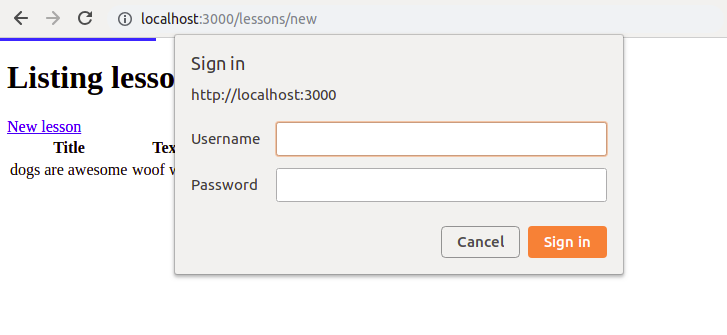

# Basic Authentication

## LessonsController

`http_basic_authenticate_with`

Block access to CRUD actions if not authenticated

```ruby
class LessonsController < ApplicationController
    
    http_basic_authenticate_with name: 'lenny', password: 'abcd1234', except: [:index, :show]
    ...

class CommentsController < ApplicationController

    http_basic_authenticate_with name: 'lenny', password: 'abcd1234', only: :destroy
    ...
```

When Create, Update, Destroy (Read is fine for non-authenticated users):




### Try Auth addon gems too:

- Devise
- Authlogic

full auth: https://guides.rubyonrails.org/v5.2/security.html


# Configuration gotchas

UTF-8
- store all external data as UTF-8
- Ruby, Rails libraries will often be able to convert your native data into UTF-8